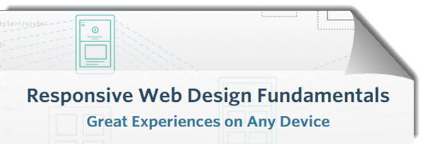

# Welcome to my study files!

Here you will find the files developed in this course on each topic.

There are folders with the number of each lesson and subfolders with the exercises developed.

This repository is made in order to present my personal progress to my program coordinator and classmates.

Any comment is welcome through the course forum system.

**Jaime Andres**

## Content

### Lessons

* [Lesson 2 - Project part 1](2017-Responsive-Web-Design-Fundamentals/Lesson-2)
